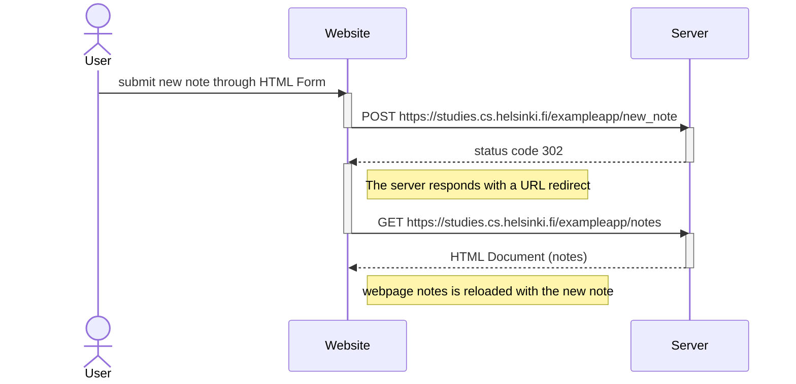
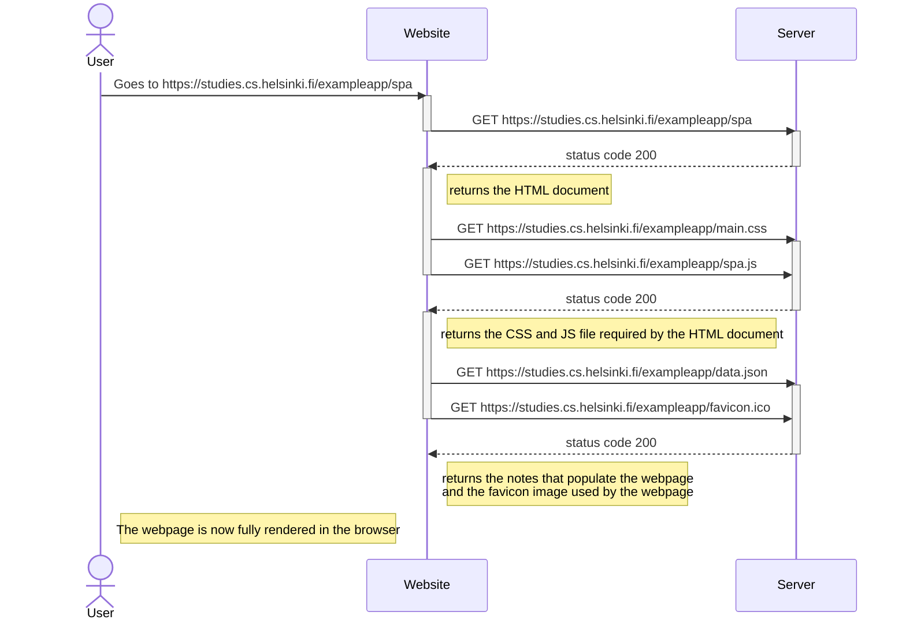
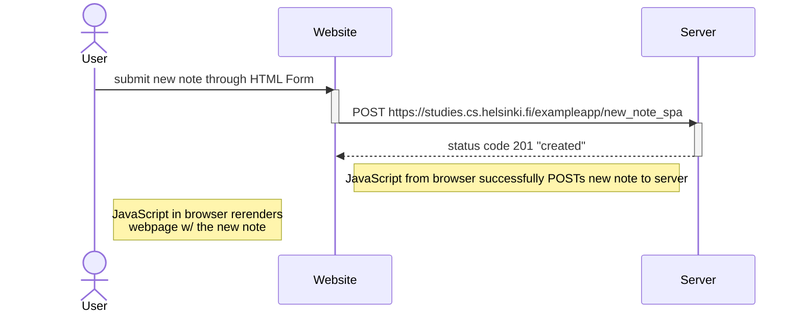

# FullStack-Part0
Is for the submission of exercise 0.4 of the Full OpenStack course. Also to get the creator, CHH02, more experience with GitHub.

## Objective
- Ex 0.4
  - To create a diagram depicting the situation where the user creates a new note on the page https://studies.cs.helsinki.fi/exampleapp/notes by writing something into the text field and clicking the submit button
- Ex 0.5
  - Create a diagram depicting the situation where the user goes to the single-page app version of the notes app at https://studies.cs.helsinki.fi/exampleapp/spa
- Ex 0.6
  - Create a diagram depicting the situation where the user creates a new note using the single-page version of the app

## Difficulties & Learnings
- Never made a markdown (MD) file
  - So I had to search & learn how about them and how to make them
- Did not know how or where to save a markdown file
  - Through my search of MD files I found out they are saved with the .md or .markdown file extentions
  - Found that you can make your MD daigram in GitHub's README file and Issues section

## My Diagrams

### Ex 0.4

### Ex 0.5

### Ex 0.6

