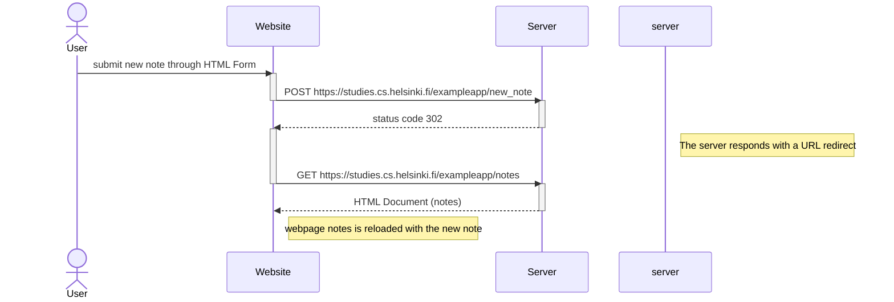

```mermaid
sequenceDiagram
	actor u as User
	participant w as Website
	participant s as Server

	u->>w: submit new note through HTML Form
	activate w
	w->>s: POST https://studies.cs.helsinki.fi/exampleapp/new_note
	deactivate w
	activate s
	s-->>w: status code 302
	deactivate s
	activate w
	Note right of server: The server responds with a URL redirect
	w->>s: GET https://studies.cs.helsinki.fi/exampleapp/notes
	deactivate w
	activate s
	s-->>w: HTML Document (notes)
	deactivate s
	Note right of w: webpage notes is reloaded with the new note
```