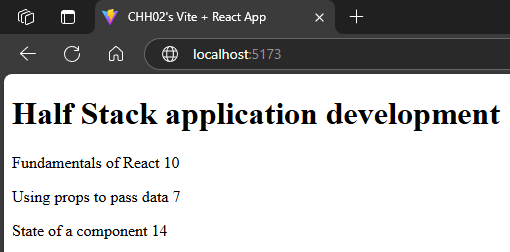
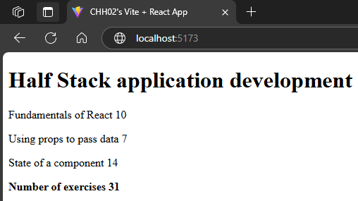
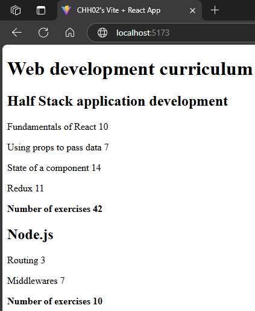
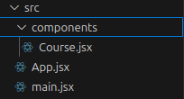

# FullStack-Part2
This is for the submission of exercises 2.1-2.20 of the Full OpenStack course. See Full Stack open part 2 [here](https://fullstackopen.com/en/part2)

## Objective
- Ex 2.5
  - Description:
    - ex 2.1-2.5 are exercises that implement better practices on ex 1.5's application, e.g., using higher-order functions and modularity for optimization.
  - Live View:
    - This React App can be seen [here](https://chh02.github.io/FullStack-Part2-courseinfo/) (https://chh02.github.io/FullStack-Part2-courseinfo/)

- Ex 2.17
  - Description:
    - ex 2.6-2.10 are exercises that develop a phonebook application that stores contact information (phone number and name). We first focus on using forms to collect data and higher-order functions to diplay filtered results.
    - ex 2.11 is an exercise to seperate our stored user data from ex 2.10 to a [json-server](https://github.com/typicode/json-server) as a sort of way to simulate how our frontend may communicate with a simple backend.
    - ex 2.12-2.15 are exercises that implement functionality for our frontend to alter data in the backend (the json-server).
    - ex 2.16-2.17 are exercises that implement some css to application.
  - Live View:
    - This React App can be seen [here](https://chh02.github.io/FullStack-phonebook/) (https://chh02.github.io/FullStack-phonebook/)

- Ex 2.20
  - Description:
    - ex 2.18-2.20 are exercises that create a countries app using all we learned from ex 2.1-2.17 that relies on an api (here I used the openweather api) to display the weather of a country specified by the user.
  - Live View:
    - This React App can be seen [here](https://chh02.github.io/FullStack-countries/) (https://chh02.github.io/FullStack-countries/)

## My Apps (Progression)

### Apps 2.1-2.5

#### Ex 2.1
- modified Ex 1.5 app with a modularized course component section, e.g., a course component outside of the app component for dispalying course information.  
<br>

#### Ex 2.2
 - modified Ex 2.1 to include the total number of exercises
<br>
```JSX
// Total component for calculating a sum of exercises displaying in our App component seen further below
const Total = (props) => {
  console.log(props)
  return <p>Number of exercises {props.parts[0].exercises + props.parts[1].exercises + props.parts[2].exercises}</p>
}
```

#### Ex 2.3
 - modified Ex 2.2 to calculate the total number of exercises using the [reduce](https://developer.mozilla.org/en-US/docs/Web/JavaScript/Reference/Global_Objects/Array/reduce) array function.
```JSX
// Total component for calculating a sum of exercises displaying in our App component seen further below
const Total = (props) => {
  console.log(props)
  return <p><strong>Number of exercises {props.parts.reduce((sum, part) => sum + part.exercises, 0)}</strong></p>
}
```

#### Ex 2.4
- modified Ex 2.3 app to support displaying information for multiple courses.  
<br>

```JSX
// App component for displaying FullStackOpen's course information
const App = () => {
  const courses = [
    /* courses' information would be here
        here is an example format for a course:
    {
      name: 'course name'
      id: 1,
      parts: [
        {
          name: 'part name',
          exercises: 10,
          id: 1
        }
      ]
    }
    */
  ]

  /* solution: used the 'map' array function to implement the support for multiple courses as seen below */
  return (
    <div>
      <h1>Web development curriculum</h1>
      {courses.map(course => <Course course={course} key={course.id} />)}
    </div>
  )
}
```

#### Ex 2.5
- modified Ex 2.4 app to separate the Course component and subcomponents into their own .jsx file from the App component .jsx file.
<br>

### Apps 2.6-2.10
#### Ex 2.6
- Created a simple phonebook. This exercise focuses on implementing the use of an HTML form into a phonebook react application. Below is my code for my "App.jsx" component which showcases how I implented this html form into the phonebook application. Please also see [Fullstack Part 2 Ex 2.6](https://fullstackopen.com/en/part2/forms#:~:text=2.6%3A%20The%20Phonebook%20Step%201) for more info.

```JSX
import { useState } from 'react'

const App = () => {
  const [persons, setPersons] = useState([
    { name: 'Arto Hellas' }
  ]) 
  const [newName, setNewName] = useState('')

  const addName = (event) => {
    event.preventDefault()
    const nameObject = {
      name: newName,
    }
    setPersons(persons.concat(nameObject))
    setNewName('')
  }

  const handleNameChange = (event) => {
    console.log(event.target.value);
    setNewName(event.target.value)    
  }
  
  return (
    <div>
      <h2>Phonebook</h2>
      <form onSubmit={addName}>
        <div>
          name: <input value={newName} onChange={handleNameChange} />
        </div>
        <div>
          <button type="submit">add</button>
        </div>
      </form>
      <h2>Numbers</h2>
      {persons.map(person => <li key={person.name}>{person.name}</li>)}
    </div>
  )
}

export default App
```

#### Ex 2.7
- Improved 2.6's simple phonebook by sanitizing the input into the phonebook. Now the exact same name cannot be submitted twice into the phonebook using the modified code below:
```JSX
const addName = (event) => {
    event.preventDefault()
    const nameObject = {
      name: newName,
    }

    {(persons.some(person => person.name === nameObject.name)) ? alert(`${nameObject.name} is already added to phonebook`) : setPersons(persons.concat(nameObject))}
    setNewName('')
  }
``` 
Specifically the ternary operator is used to check whether there is already "[some](https://developer.mozilla.org/en-US/docs/Web/JavaScript/Reference/Global_Objects/Array/some)" person in the array of persons whose name is the same as the one being submitted, if so then raise an [alert](https://developer.mozilla.org/en-US/docs/Web/API/Window/alert) or if not then add that person to the phonebook.

#### Ex 2.8
- Modified 2.7's phonebook accordingly below:

```JSX
  ...
  const [newNumber, setNewNumber] = useState('') // new state variable to track a person's number

  // use new state variable when adding a new person to phonebook
  const addPerson = (event) => {
    event.preventDefault()
    const nameObject = {
      name: newName,
      number: newNumber,
    }

    {(persons.some(person => person.name === nameObject.name)) ? alert(`${nameObject.name} is already added to phonebook`) : setPersons(persons.concat(nameObject))}
    setNewName('')
    setNewNumber('')
  }

  ...

  // track changes made to the number inputted into application
  const handleNumberChange = (event) => {
    console.log(event.target.value)
    setNewNumber(event.target.value)    
  }
  
  return (
    <div>
      <h2>Phonebook</h2>
      <form onSubmit={addPerson}>
        <div>
          name: <input value={newName} onChange={handleNameChange} />
        </div>
        {/* input field to add a number of a person into the phonebook */}
        <div>
          number: <input value={newNumber} onChange={handleNumberChange} />
        </div>
        <div>
          <button type="submit">add</button>
        </div>
      </form>
      <h2>Numbers</h2>
      {/* updated display to display a person's number as well */}
      {persons.map(person => <li key={person.name}>{person.name} {person.number}</li>)}
    </div>
  )
}
```

#### Ex 2.9
- Modified app from ex 2.8 to include a case insensitive search field to filter the list of people by name in the phonebook. See [Fullstackopen's Ex 2.9](https://fullstackopen.com/en/part2/forms#:~:text=2.9*%3A%20The%20Phonebook%20Step%204) directions for more info. Acheived this by adding a new state (i.e., "newFilter" variable) variable to track the filter and used it in the logic seen below to determine which people to display accordingly.
```JSX
  const personsToShow = (newFilter === '') ? persons : persons.filter(person => person.name.toLowerCase().includes(newFilter.toLowerCase()))

```

#### Ex 2.10
- Refactored app ex 2.9 into separate jsx files to render their respective components (i.e., Filter, PersonForm, and Persons components). See [Fullstackopen's Ex 2.10](https://fullstackopen.com/en/part2/forms#:~:text=2.10%3A%20The%20Phonebook%20Step%205) directions for more info.

### Ex 2.11
- Modified the phonebook application such that the initial state of the data is fetched from the server using the axios-library. Complete the fetching with an Effect hook.

### Ex 2.12-2.15
#### Ex 2.12
- Modified ex 2.11's phonebook to not only retreive our data (e.g., persons) from the (backend) server (i.e., json-server) but also save/add data to the server.

#### Ex 2.13
- Modified ex 2.12's phonebook to extract the communication to the server into its own service file.

#### Ex 2.14
- Modified ex 2.13's phonebook to add functionality for deleting data from the backend server

#### Ex 2.15
- Modified ex 2.14's phonebook to add functionality for updating/changing previously added/saved data to the server using HTTP PUT.

### Ex 2.16-2.17
- Goal was to modify the phonebook application with css styling

#### Ex 2.16
- Modified 2.15's application to display a notification to the screen when a person is added or updated in the phonebook, styled with css.

#### Ex 2.17
- Modified 2.16's application to handle potential uncaught promises when adding and updating persons in the phonebook. Sends an error notification to the display styled with css.

### Ex 2.18-2.20
- Focuses on an application for different country's information

#### Ex 2.18
- App that accepts a filter from the user to display different country's information. If more than 10 matches then it querries user to provide a more specific filter. If only one match then it displays general information for that one country. Otherwise lists the countries whose common name matches the filter.

#### Ex 2.19
- Modified 2.18's app to include a "show" button next to countries displayed when the filter has matched with more than one but less than 11. This button allows the user to select a country to display its information without having to make their filter more specific.

#### Ex 2.20
- Added weather of the capital of the selected country when displaying a country's information. Used openweather's free weather API to get the weather information. Took time to understand a/the correct way to use the effect hook for calling the API to get the weather to display.