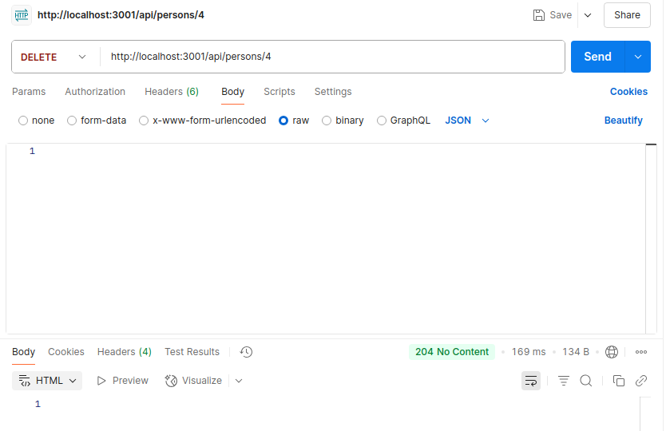
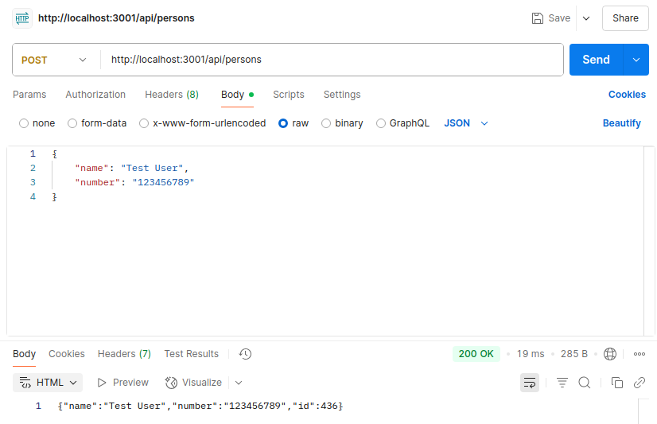
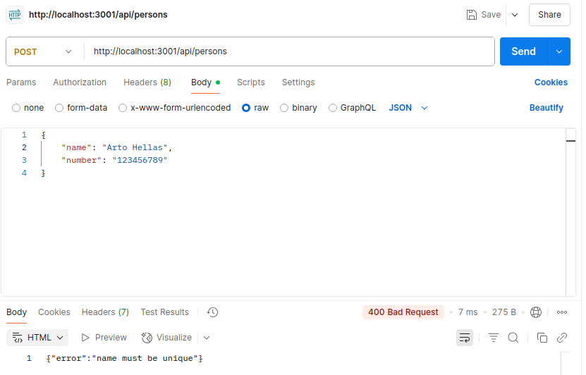
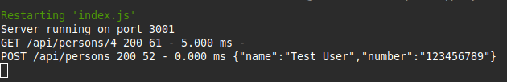

# FullStack-Part3
This is for the submission of exercises 3.1-3.22 of the Full OpenStack course. See Full Stack open part 3 [here](https://fullstackopen.com/en/part3)

## My Apps

### Apps 3.1-3.8
#### Ex 3.1
- Implemented a Node application that returns a hardcoded list of phonebook entries at .../api/persons.

#### Ex 3.2
- Implemented a page at .../info that displays how many people are currently in the phonebook and at what time the server received this get request.

#### Ex 3.3
- Implemented the functionality for displaying the information for a single phonebook entry, e.g., .../api/person/{id_of_resource_here}.

#### Ex 3.4
- Implemented functionality for deleting a single phonebook entry from the server.
<br>

#### Ex 3.5
- Expanded the backend so new phonebook entries can be added by using HTTP POST requests to .../api/persons.
<br>

#### Ex 3.6
- Implemented error handling for creating new entries:
```JS
app.post('/api/persons', (request, response) => {
    const body = request.body
  
    // Error Handling
    if (!body.name) {   // must have a name
        return response.status(400).json({ 
            error: 'name missing' 
        })
    } else if (!body.number) {  // must have a number
        return response.status(400).json({
            error: 'number missing'
        })
    } else if (persons.some(n => n.name === body.name)) {   // must be a unique name
        return response.status(400).json({
            error: 'name must be unique'
        })
    }
  
    const person = {
      name: body.name,
      number: body.number,
      id: String(Math.trunc(Math.random() * 1000)),
    }
  
    persons = persons.concat(person)
  
    response.json(person)
})
```
<br>

#### Ex 3.7
- Added the [morgan](https://github.com/expressjs/morgan) middleware to the phonebook application for logging requests made to the server on the backend.
```Bash
npm install morgan
```
```JS
const morgan = require('morgan')
...
app.use(morgan('tiny'))
```

#### Ex 3.8
- Configured morgan so that it also shows the data sent with requests, e.g., with HTTP POST requests.
<br>
<br>

```JS
// created a custon morgan token and stringify'd it to print to the console
morgan.token('body', request => JSON.stringify(request.body))
...
// modified morgan middleware paramaters to accept the custom token created above
app.use(morgan(':method :url :status :res[content-length] - :response-time ms :body'))
```

### Apps 3.9-3.11
- Examples that modify the phonebook frontend application made in Ex 2.17 to work with the phonebook backend application made in 3.8, and then deploy this to the internet.

#### Ex 3.9
- Modify the phonebook application's frontend and backend to work with eachother.
```JS
// modify the persons.js file from Ex 2.17's frontend phonebook application
// change baseUrl to our backend phonebook application from Ex 3.8
// before: const baseUrl = 'http://localhost:3001/persons' 
// after:  const baseUrl = 'http://localhost:3001/api/persons'
import axios from 'axios'
const baseUrl = 'http://localhost:3001/api/persons'

const getAll = () => {...}

const create = newObject => {...}

const remove = id => {...}

const update = (id, newObject) => {...}

export default { getAll, create, remove, update }
```

```JS
// install "npm install cors" on the backend application from Ex 3.8
// then modify the backend's index.js file to use this cors to address
// same origin policy conflict
const express = require('express')
const morgan = require('morgan')
const cors = require('cors')
const app = express()
...
app.use(cors)
```

#### Ex 3.10
- Deploy the phonebook application's backend modified in Ex 3.9 above to the internet
 - Note: I used render to do it, here is the [link](https://render-test-ushk.onrender.com)
```JS
// modify the backend's index.js file to listen to Render's port provided in the environment when deployed to the internet
// before: const PORT = 3001
// after: const PORT = process.env.PORT || 3001
const PORT = process.env.PORT || 3001
```
- The following changes were made for development purposes:
```JS
// for development purposes, modify vite.config.js to proxy to backend
// so we can remove cors and run our build locally like it is seen on render (the internet)
import { defineConfig } from 'vite'
import react from '@vitejs/plugin-react'

// https://vitejs.dev/config/
export default defineConfig({
  plugins: [react()],
  server: {
    proxy: {
      '/api': {
        target: 'http://localhost:3001',
        changeOrigin: true,
      },
    }
  },
})
```
```JS
// Uninstall "npm revmove cors" on the backend application from Ex 3.9.
// Then modify the backend's index.js file to remove cors
const express = require('express')
const morgan = require('morgan')
//const cors = require('cors') -> deleted
const app = express()
...
//app.use(cors) -> deleted
```

#### Ex 3.11
- Deploy the phonebook application's frontend modified in Ex 3.9 above to the internet through the backend from Ex 3.10
 - Note: I used render to do it, here is the [link](https://render-test-ushk.onrender.com)
```JS
// modify the persons.js file from Ex 3.9's frontend phonebook application
// change baseUrl to use relative URL since here the frontend and backend have the same address 
// before:  const baseUrl = 'http://localhost:3001/api/persons'
// after: const baseUrl = '/api/persons'
import axios from 'axios'
const baseUrl = '/api/persons'

const getAll = () => {...}

const create = newObject => {...}

const remove = id => {...}

const update = (id, newObject) => {...}

export default { getAll, create, remove, update }
```
```JS
// modify index.js file from Ex 3.10's backend phonebook application
// to serve our frontend build in 'dist' as static files
...
app.use(express.static('dist'))
```