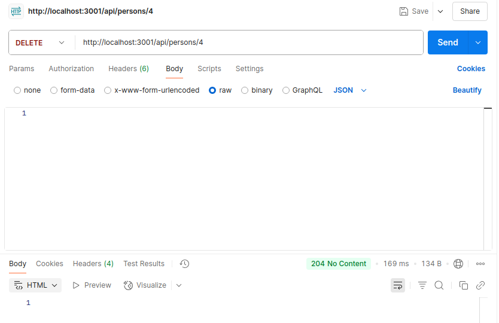
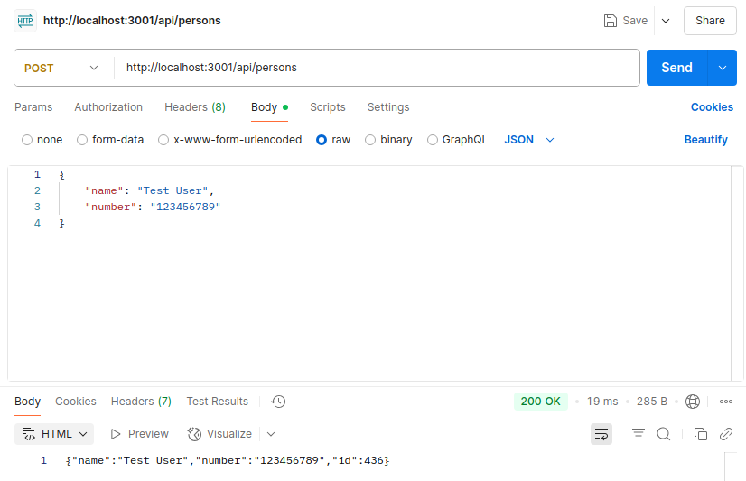
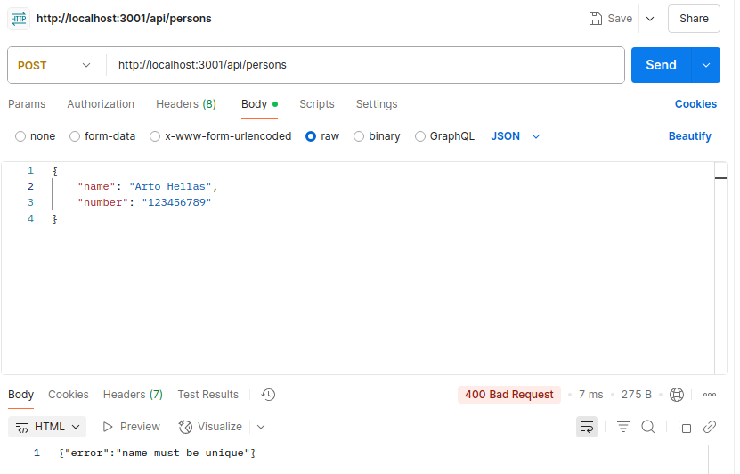
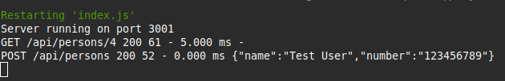
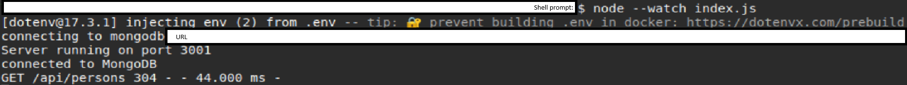
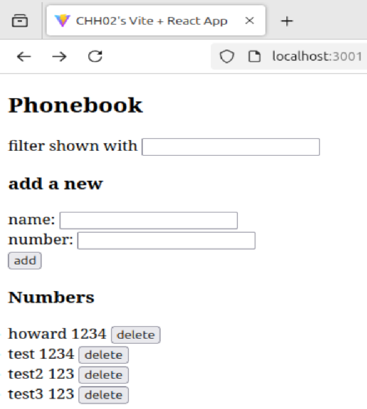
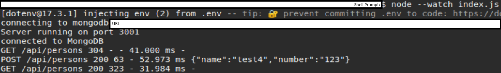

# FullStack-Part3
This is for the submission of exercises 3.1-3.22 of the Full OpenStack course. See Full Stack open part 3 [here](https://fullstackopen.com/en/part3)

## Objective
- Ex 3.11
  - Description:
    - ex 3.1-3.6 are exercises for creating a backend api server for the phonebook application from ex 2.17 using Node js and Express.
    - ex 3.7-3.8 are exercises for understanding middleware, here we implement [Morgan](https://github.com/expressjs/morgan) as middleware for this purpose.
    - ex 3.9-3.11 are exercises that connect ex 2.17's phonebook application to this phonebook backend and to then deploy it to the internet. Here we use render to deploy our backend web service that also servers the phonebook frontend's production build statically.
  - Live View:
    - This React App can be seen [here](https://render-test-ushk.onrender.com) (https://render-test-ushk.onrender.com)

## My Apps

### Apps 3.1-3.8
#### Ex 3.1
- Implemented a Node application that returns a hardcoded list of phonebook entries at .../api/persons.

#### Ex 3.2
- Implemented a page at .../info that displays how many people are currently in the phonebook and at what time the server received this get request.

#### Ex 3.3
- Implemented the functionality for displaying the information for a single phonebook entry, e.g., .../api/person/{id_of_resource_here}.

#### Ex 3.4
- Implemented functionality for deleting a single phonebook entry from the server.
<br>

#### Ex 3.5
- Expanded the backend so new phonebook entries can be added by using HTTP POST requests to .../api/persons.
<br>

#### Ex 3.6
- Implemented error handling for creating new entries:
```JS
app.post('/api/persons', (request, response) => {
    const body = request.body
  
    // Error Handling
    if (!body.name) {   // must have a name
        return response.status(400).json({ 
            error: 'name missing' 
        })
    } else if (!body.number) {  // must have a number
        return response.status(400).json({
            error: 'number missing'
        })
    } else if (persons.some(n => n.name === body.name)) {   // must be a unique name
        return response.status(400).json({
            error: 'name must be unique'
        })
    }
  
    const person = {
      name: body.name,
      number: body.number,
      id: String(Math.trunc(Math.random() * 1000)),
    }
  
    persons = persons.concat(person)
  
    response.json(person)
})
```
<br>

#### Ex 3.7
- Added the [morgan](https://github.com/expressjs/morgan) middleware to the phonebook application for logging requests made to the server on the backend.
```Bash
npm install morgan
```
```JS
const morgan = require('morgan')
...
app.use(morgan('tiny'))
```

#### Ex 3.8
- Configured morgan so that it also shows the data sent with requests, e.g., with HTTP POST requests.
<br>
<br>

```JS
// created a custon morgan token and stringify'd it to print to the console
morgan.token('body', request => JSON.stringify(request.body))
...
// modified morgan middleware paramaters to accept the custom token created above
app.use(morgan(':method :url :status :res[content-length] - :response-time ms :body'))
```

### Apps 3.9-3.11
- Examples that modify the phonebook frontend application made in Ex 2.17 to work with the phonebook backend application made in 3.8, and then deploy this to the internet.

#### Ex 3.9
- Modify the phonebook application's frontend and backend to work with eachother.
```JS
// modify the persons.js file from Ex 2.17's frontend phonebook application
// change baseUrl to our backend phonebook application from Ex 3.8
// before: const baseUrl = 'http://localhost:3001/persons' 
// after:  const baseUrl = 'http://localhost:3001/api/persons'
import axios from 'axios'
const baseUrl = 'http://localhost:3001/api/persons'

const getAll = () => {...}

const create = newObject => {...}

const remove = id => {...}

const update = (id, newObject) => {...}

export default { getAll, create, remove, update }
```

```JS
// install "npm install cors" on the backend application from Ex 3.8
// then modify the backend's index.js file to use this cors to address
// same origin policy conflict
const express = require('express')
const morgan = require('morgan')
const cors = require('cors')
const app = express()
...
app.use(cors)
```

#### Ex 3.10
- Deploy the phonebook application's backend modified in Ex 3.9 above to the internet
 - Note: I used render to do it, here is the [link](https://render-test-ushk.onrender.com)
```JS
// modify the backend's index.js file to listen to Render's port provided in the environment when deployed to the internet
// before: const PORT = 3001
// after: const PORT = process.env.PORT || 3001
const PORT = process.env.PORT || 3001
```
- The following changes were made for development purposes:
```JS
// for development purposes, modify vite.config.js to proxy to backend
// so we can remove cors and run our build locally like it is seen on render (the internet)
import { defineConfig } from 'vite'
import react from '@vitejs/plugin-react'

// https://vitejs.dev/config/
export default defineConfig({
  plugins: [react()],
  server: {
    proxy: {
      '/api': {
        target: 'http://localhost:3001',
        changeOrigin: true,
      },
    }
  },
})
```
```JS
// Uninstall "npm revmove cors" on the backend application from Ex 3.9.
// Then modify the backend's index.js file to remove cors
const express = require('express')
const morgan = require('morgan')
//const cors = require('cors') -> deleted
const app = express()
...
//app.use(cors) -> deleted
```

#### Ex 3.11
- Deploy the phonebook application's frontend modified in Ex 3.9 above to the internet through the backend from Ex 3.10
 - Note: I used render to do it, here is the [link](https://render-test-ushk.onrender.com)
```JS
// modify the persons.js file from Ex 3.9's frontend phonebook application
// change baseUrl to use relative URL since here the frontend and backend have the same address 
// before:  const baseUrl = 'http://localhost:3001/api/persons'
// after: const baseUrl = '/api/persons'
import axios from 'axios'
const baseUrl = '/api/persons'

const getAll = () => {...}

const create = newObject => {...}

const remove = id => {...}

const update = (id, newObject) => {...}

export default { getAll, create, remove, update }
```
```JS
// modify index.js file from Ex 3.10's backend phonebook application
// to serve our frontend build in 'dist' as static files
...
app.use(express.static('dist'))
```

### Apps 3.12-3.14
#### Ex 3.12
- Create a cloud-based MongoDB database for the phonebook application with MongoDB Atlas. Create a mongo.js file in the project directory, that can be used for adding entries to the phonebook, and for listing all of the existing entries in the phonebook.

```js 
### mongo.js ###

const mongoose = require('mongoose')
...
mongoose.set('strictQuery',false)
mongoose.connect(url, { family: 4 })

const personSchema = new mongoose.Schema({
  name: String,
  number: String,
})

const Person = mongoose.model('Person', personSchema)

// add person to phonebook database if given the data to add
if (name && number) {
    
    const person = new Person({
      name: name,
      number: number,
    })
    
    person.save().then(result => {
      console.log(`added ${person.name} number ${person.number} to phonebook`)
      mongoose.connection.close()
    }).catch(err => { ... })
}
// else if no data is given then just return all database entries so far 
else if (!name && !number) {
    Person.find({}).then(result => {
        console.log('phonebook:');
        result.forEach(person => {
          console.log(`${person.name} ${person.number}`)
        })
        mongoose.connection.close()
      }).catch(err => { ... })
}
// otherwise something must have gone wrong so go ahead and close connection to DB
else {
    mongoose.connection.close()
    console.log("Incomplete set of data, give a name and a number. Terminating connection... ");
    process.exit(1)   
}
```

#### Ex 3.13
- Change the fetching of all phonebook entries so that the data is fetched from the database. Verify that the frontend works after the changes have been made. Write all Mongoose-specific code into its own module.

```JS
### index.js ###

// modify Ex 3.11's index.js file to use our database

require('dotenv').config()  // added this line to access environment variables
const express = require('express')
const morgan = require('morgan')
const Person = require('./models/person') // added this line to import our person model

const app = express()
morgan.token('body', request => JSON.stringify(request.body))

app.use(express.static('dist'))
app.use(express.json())
app.use(morgan(':method :url :status :res[content-length] - :response-time ms :body'))

let persons = []  // replaced hardcoded data with empty []

app.get('/api/persons', (request, response) => {
    // modified this function to use our database's person model to fetch persons data
    Person.find({}).then((persons) => {
        response.json(persons)
    })
})

app.get('/info', (request, response) => {...})

app.get('/api/persons/:id', (request, response) => {...})

app.delete('/api/persons/:id', (request, response) => {...})
  
app.post('/api/persons', (request, response) => {...})

const PORT = process.env.PORT // removed "|| 3001" as we use an environment variable instead
app.listen(PORT, () => {
  console.log(`Server running on port ${PORT}`)
})
```

```JS
### perons.js ###

// create a person.js file to model our data for the database

const mongoose = require('mongoose')

mongoose.set('strictQuery', false)

const url = process.env.MONGODB_URI

console.log('connecting to', url)
mongoose.connect(url, { family: 4 })

  .then(result => {
    console.log('connected to MongoDB')
  })
  .catch(error => {
    console.log('error connecting to MongoDB:', error.message)
  })

const personSchema = new mongoose.Schema({
  name: String,
  number: String,
})

personSchema.set('toJSON', {
  transform: (document, returnedObject) => {
    returnedObject.id = returnedObject._id.toString()
    delete returnedObject._id
    delete returnedObject.__v
  }
})


module.exports = mongoose.model('Person', personSchema)
```

- Here are some screenshots from the browser and terminal to verify that the frontend works with these changes:
<br>
<br>
<br>

#### Ex 3.14
- Change the backend so that new numbers are saved to the database. Verify that the frontend still works after the changes. At this stage, we're ignoring whether there is already a person in the database with the same name as the person being added.

```JS
### index.js ###

// modify Ex 3.13's index.js file to use our database

... // beginning of file

app.get('/api/persons/:id', (request, response) => {
    // modified this function to use our database's person model to fetch a person from the database

    const id = request.params.id
  
    Person.findById(id)
        .then((person) => {
            response.json(person)
        })
        .catch((error) => {
            console.log('error finding person by ID:', error.message);
            response.status(404).end()
        })
})

app.delete('/api/persons/:id', (request, response) => {...})
  
app.post('/api/persons', (request, response) => {
    // modified this function to use our database's person model to save person data to database

    const body = request.body
  
    if (!body.name) {
        return response.status(400).json({ 
            error: 'name missing' 
        })
    } else if (!body.number) {
        return response.status(400).json({
            error: 'number missing'
        })
    } else if (persons.some(n => n.name === body.name)) {
        return response.status(400).json({
            error: 'name must be unique'
        })
    }
  
    const person = new Person({
      name: body.name,
      number: body.number
    })
    
    person.save().then((savedPerson) => {
        response.json(savedPerson)
    })
})

... // rest of file

```

- Here are some screenshots from the browser and terminal to verify that the frontend works with these changes:
<br>
<br>
<br>
<br>
<br>