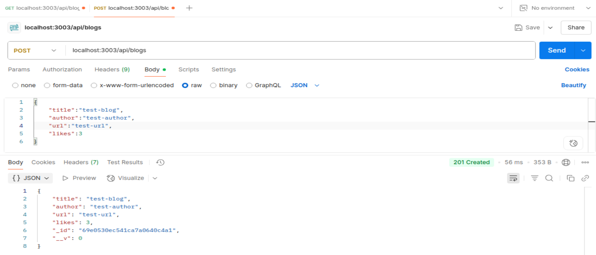
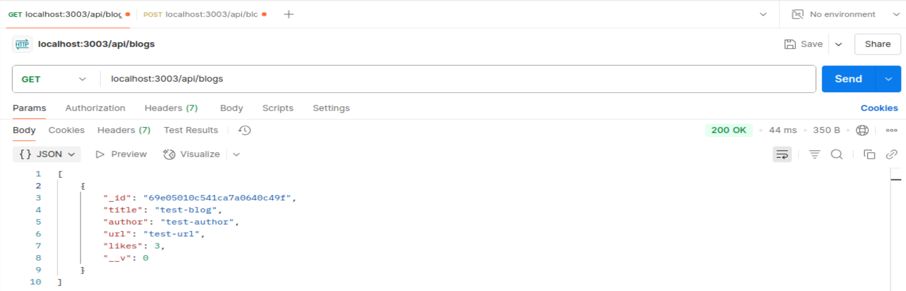
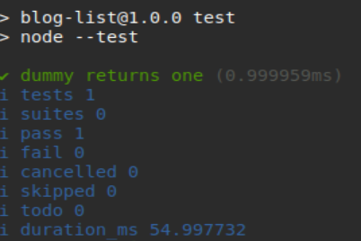

# FullStack-Part4
This is for the submission of exercises 4.1-4.23 of the FullStack Open's course. See Full Stack open part 4 [here](https://fullstackopen.com/en/part4)

## Objective
- Ex 4.7
  - ex 4.1-4.2 are exercises to start a backend api server to save blogs to a MongoDB Atlas database and practice project structure best practacies.
  - ex 4.3-7 are exercises to introduce writing helper functions and unit tests for those functions to the blog list app from ex 4.2.
  - ex 4.8-4.12 are exercises to introduce using async/await code instead and to write API-level integration tests for our server application.

## My Apps

### Apps 4.1-4.9
#### Ex 4.1
- Created a npm project for a backend api server that saves blogs to a MongoDB Atlas database.

- Here are some screenshots from Postman to verify that the api endpoints and MongoDB Atlas database are working:
<br>
<br>
<br>
<br>

#### Ex 4.2
- Refactored the application into separate modules as shown in [this](https://fullstackopen.com/en/part4/structure_of_backend_application_introduction_to_testing#project-structure) part of the course material. For example:

```
├── controllers
│   └── notes.js
├── dist
│   └── ...
├── models
│   └── note.js
├── utils
│   ├── config.js
│   ├── logger.js
│   └── middleware.js  
├── app.js
├── index.js
├── package-lock.json
├── package.json
```

#### Ex 4.3
- Defined a dummy function that receives an array of blog posts as a parameter and always returns the value 1. Then, Verified that your test configuration works with the following test:

```JS
const { test, describe } = require('node:test')
const assert = require('node:assert')
const listHelper = require('../utils/list_helper')

test('dummy returns one', () => {
  const blogs = []

  const result = listHelper.dummy(blogs)
  assert.strictEqual(result, 1)
})
```
- Here is a screenshot from the terminal to verify that the helper function passed the unit test:
<br>
<br>

#### Ex 4.4
- Defined a new totalLikes function that receives a list of blog posts as a parameter. The function returns the total sum of likes in all of the blog posts. Wrote appropriate tests for the function.

```JS
### utils/list_helper.js ###

... // beginning of file

const totalLikes = (blogs) => {
  return blogs.reduce((sum, item) => {
    return sum + item.likes
  }, 0)
}

... // rest of file
```

```JS
### totalLikes.test.js ###

const { test, describe } = require('node:test')
const assert = require('node:assert')
const listHelper = require('../utils/list_helper')

describe('total likes', () => {
  const listWithOneBlog = [
    {
      _id: '5a422aa71b54a676234d17f8',
      title: 'Go To Statement Considered Harmful',
      author: 'Edsger W. Dijkstra',
      url: 'https://homepages.cwi.nl/~storm/teaching/reader/Dijkstra68.pdf',
      likes: 5,
      __v: 0
    }
  ]

  const blogs = [...] // see the note below for list

  test('when list has only one blog, equals the likes of that', () => {
    const result = listHelper.totalLikes(listWithOneBlog)
    assert.strictEqual(result, 5)
  })

  test('when list has many blogs', () => {
    const result = listHelper.totalLikes(blogs)
    assert.strictEqual(result, 36)
  })

  test('when list has no blogs', () => {
    const result = listHelper.totalLikes([])
    assert.strictEqual(result, 0)
  })
})
```
note: blogs testing input list can be found [here](https://github.com/fullstack-hy2020/misc/blob/master/blogs_for_test.md).

#### Ex 4.5
- Defined a new favoriteBlog function that receives a list of blogs as a parameter. The function returns the blog with the most likes. If there are multiple favorites, it returns the first one of them. Wrote the tests for this exercise inside of a new describe block.

```JS
### utils/list_helper.js ###

... // beginning of file

const favoriteBlog = (blogs) => {
  return blogs.reduce((lastItem, currentItem) => (lastItem.likes > currentItem.likes)
  ? lastItem : currentItem, {})
}

... // rest of file
```

```JS
### favoriteBlog.test.js ###

const { test, describe } = require('node:test')
const assert = require('node:assert')
const listHelper = require('../utils/list_helper')

describe('favorite blog', () => {
  const listWithOneBlog = [...]

  const blogs = [...]

  test('when list has only one blog', () => {
    const result = listHelper.favoriteBlog(listWithOneBlog)
    assert.deepStrictEqual(result, listWithOneBlog[0])
  })

  test('when list has many blogs', () => {
    const result = listHelper.favoriteBlog(blogs)
    assert.deepStrictEqual(result, blogs[2])
  })

  test('when list has no blogs', () => {
    const result = listHelper.favoriteBlog([])
    assert.deepStrictEqual(result, {})
  })
})
```

#### Ex 4.6
- Defined a function called mostBlogs that receives an array of blogs as a parameter. The function returns the author who has the largest amount of blogs. The return value also contains the number of blogs the top author has. If there are many top bloggers, then it is enough to return any one of them.

```JS
### utils/list_helper.js ###

... // beginning of file

const mostBlogs = (blogs) => {
  if (blogs.length === 0)
    return {}
  
  const freq = {}

  for (const item of blogs) {
    freq[item.author] = (freq[item.author] || 0) + 1
  }

  result = Object.entries(freq).reduce((lastItem, currentItem) => {
    return currentItem[1] > lastItem[1] ? currentItem : lastItem
  })

  return {
    author: result[0],
    blogs: result[1]
  }
}

... // rest of file
```

```JS
### mostBlogs.test.js ###

const { test, describe } = require('node:test')
const assert = require('node:assert')
const listHelper = require('../utils/list_helper')

describe('most blogs', () => {
  const listWithOneBlog = [...]

  const blogs = [...]

  test('when list has only one blog', () => {
    const result = listHelper.mostBlogs(listWithOneBlog)
    assert.deepStrictEqual(result,
      {
        author: "Edsger W. Dijkstra",
        blogs: 1
      }
    )
  })

  test('when list has many blogs', () => {
    const result = listHelper.mostBlogs(blogs)
    assert.deepStrictEqual(result, 
      {
        author: "Robert C. Martin",
        blogs: 3
      }
    )
  })

  test('when list has no blogs', () => {
    const result = listHelper.mostBlogs([])
    assert.deepStrictEqual(result, {})
  })
})
```

#### Ex 4.7
- Defined a function called mostLikes that receives an array of blogs as its parameter. The function returns the author whose blog posts have the largest amount of likes. The return value also contains the total number of likes that the author has received. If there are many top bloggers, then it is enough to show any one of them.

```JS
### utils/list_helper.js ###

... // beginning of file

const mostLikes = (blogs) => {
  if (blogs.length === 0)
    return {}
  
  const freq = {}

  for (const item of blogs) {
    freq[item.author] = (freq[item.author] || 0) + item.likes
  }

  result = Object.entries(freq).reduce((lastItem, currentItem) => {
    return currentItem[1] > lastItem[1] ? currentItem : lastItem
  })

  return {
    author: result[0],
    likes: result[1]
  }
}

... // rest of file
```

```JS
### mostBlogs.test.js ###

const { test, describe } = require('node:test')
const assert = require('node:assert')
const listHelper = require('../utils/list_helper')

describe('most likes', () => {
  const listWithOneBlog = [...]

  const blogs = [...]

  test('when list has only one blog', () => {
    const result = listHelper.mostLikes(listWithOneBlog)
    assert.deepStrictEqual(result,
      {
        author: "Edsger W. Dijkstra",
        likes: 5
      }
    )
  })

  test('when list has many blogs', () => {
    const result = listHelper.mostLikes(blogs)
    assert.deepStrictEqual(result, 
      {
        author: "Edsger W. Dijkstra",
        likes: 17
      }
    )
  })

  test('when list has no blogs', () => {
    const result = listHelper.mostLikes([])
    assert.deepStrictEqual(result, {})
  })
})
```

#### Ex 4.8
- Used the [SuperTest](https://github.com/forwardemail/supertest) library for writing a test that makes an HTTP GET request to the /api/blogs URL. Verified that the blog list application returns the correct amount of blog posts in the JSON format. Once the test is finished, refactored the route handler to use the async/await syntax instead of promises.

```JS
### tests/test_helper.js ###

// created this file for helper functions of commonly used code in the tests

const Blog = require('../models/blog')

const initialBlogs = [...]

const nonExistingId = async () => {
  const blog = new Blog({ content: 'willremovethissoon' })
  await blog.save()
  await blog.deleteOne()

  return blog._id.toString()
}

const blogsInDb = async () => {
  const notes = await Blog.find({})
  return notes.map(blog => blog.toJSON())
}

module.exports = {
  initialBlogs, nonExistingId, blogsInDb
}
```

```JS
### blog_api.test.js ###

// created this file to write api-level integration tests for Fullstack Open's course exercises

const assert = require('node:assert')
const { test, after, beforeEach, describe } = require('node:test')
const mongoose = require('mongoose')
const supertest = require('supertest')
const app = require('../app')

const helper = require('./test_helper')
const Blog = require('../models/blog')

const api = supertest(app)

describe('when there is initially some blogs saved', () => {
  beforeEach(async () => {
    await Blog.deleteMany({})
    await Blog.insertMany(helper.initialBlogs)
  })

  describe('testing GET requests', () => {
    test('blogs are returned as json', async () => {
      await api
        .get('/api/blogs')
        .expect(200)
        .expect('Content-Type', /application\/json/)
    })
    
    test('all blogs are returned', async () => {
      const response = await api.get('/api/blogs')
    
      assert.strictEqual(response.body.length, helper.initialBlogs.length)
    })
    
    test('a specific blog is within the returned blogs', async () => {
      const response = await api.get('/api/blogs')
    
      const titles = response.body.map(e => e.title)
      assert(titles.includes('React patterns'))
    })
  })
})

after(async () => {
  await mongoose.connection.close()
})
```

```JS
### controllers/blogs.js ###

const blogsRouter = require('express').Router()
const Blog = require('../models/blog')

// refactored route handler for get requests to use async/await instead
blogsRouter.get('/', async (request, response) => {
  const blogs = await Blog.find({})
  response.json(blogs)
})

... // rest of file
```

#### Ex 4.9
- Wrote a test that verifies that the unique identifier property of the blog posts is named id, by default the database names the property _id.

```JS
### blog_api.test.js ###

... // beginning setup of file

describe('when there is initially some blogs saved', () => {
  beforeEach(async () => {
    await Blog.deleteMany({})
    await Blog.insertMany(helper.initialBlogs)
  })

  ... // previous code for testing GET requests

  // new code to verify that the unique identifier is named id
  describe('verifying that the unique identifier is named id', () => {
    test('all blogs have an id property', async () => {
      const response = await api.get('/api/blogs')

      const isIdProperty = response.body.every(e => e.hasOwnProperty('id'))
      assert.strictEqual(isIdProperty, true)
    })

    test('no blogs have _id property', async () => {
      const response = await api.get('/api/blogs')

      const is_idProperty = response.body.some(e => '_id' in e)
      assert.strictEqual(is_idProperty, false)
    })
  })
})

after(async () => {
  await mongoose.connection.close()
})
```